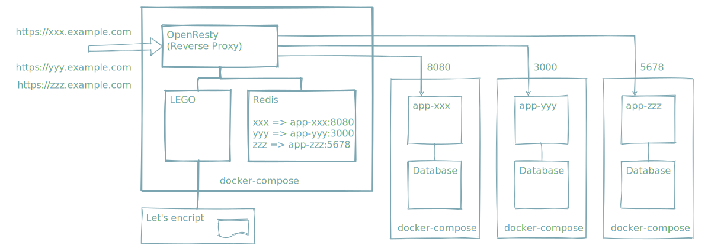

# WHABO



## Install

### Dependence

- Local PC

```terminal
$ docker -v
Docker version 19.03.12, build 48a66213fe

$ docker-compose -v
docker-compose version 1.27.2, build 18f557f9
```

### In the case of AWS

#### Note

- These strings need to be replaced.
  - 192.0.2.1
  - example.com
  - your-name

#### Create instance

- Elastic IP
  - Allocate address.
    - 192.0.2.1
- EC2
  - Run instance.
    - AMI
      - Amazon Linux 2
    - Security Group
      - Inbound Roles
        - Ports: 22, 80, 443
  - associate address
    - 192.0.2.1
- Route53
  - Register domain.
  - Add record sets.
    - Name: example.com
      - Type: A
      - Routing Polcy: Simple
      - Value: 192.0.2.1
    - Name: *.example.com
      - Type: A
      - Routing Polcy: Simple
      - Value: 192.0.2.1

#### Install Docker from Local PC

- Add the following to `~/.ssh/config`.
- `xxxxx.pem` is the keypair for ec2 instance

```text
Host whabo
  Hostname 192.0.2.1
  User ec2-user
  IdentityFile ~/.ssh/xxxxx.pem
```

- Install Docker on EC2 Instance.

```bash
ssh whabo sudo amazon-linux-extras install docker -y
ssh whabo sudo systemctl start docker
ssh whabo sudo systemctl enable docker
ssh whabo sudo gpasswd -a ec2-user docker
ssh whabo docker -v

ssh whabo sudo curl -L "https://github.com/docker/compose/releases/download/1.27.3/docker-compose-Linux-x86_64" -o /usr/local/bin/docker-compose
ssh whabo sudo chmod +x /usr/local/bin/docker-compose
ssh whabo docker-compose -v
```

- Create your user on EC2 Instance.
  - Required by docker context.
    - `docker-compose` does not support `~/.ssh/config`. (as of September 21, 2020)

```bash
cat <<EOF >> ./adduser.sh
#!/bin/bash

USER_NAME=\$1
sudo useradd \${USER_NAME}
sudo mkdir /home/\${USER_NAME}/.ssh
sudo chown \${USER_NAME}:\${USER_NAME} /home/\${USER_NAME}/.ssh
sudo chmod 700 /home/\${USER_NAME}/.ssh

sudo mv ~/authorized_keys /home/\${USER_NAME}/.ssh/
sudo chown \${USER_NAME}:\${USER_NAME} /home/\${USER_NAME}/.ssh/authorized_keys
sudo chmod 600 /home/\${USER_NAME}/.ssh/authorized_keys
sudo gpasswd -a \${USER_NAME} docker
EOF

scp ./adduser.sh whabo:~/adduser.sh
rm -f ./adduser.sh

ssh whabo chmod +x /home/ec2-user/adduser.sh

scp ~/.ssh/id_rsa.pub whabo:~/authorized_keys

# Replace `your-name`
ssh whabo /home/ec2-user/adduser.sh your-name
```

#### Create Docker volume and network from Local PC

- Create docker context.

```bash
# Replace `your-name` and `192.0.2.1`
docker context create whabo --docker "host=ssh://your-name@192.0.2.1"
```

- Create volume and network on EC2 Instance

```bash
docker -c whabo volume create --driver local whabo-certs
docker -c whabo network create -d bridge reverse-proxy-net
```

- Check volume and network.

```bash
docker -c whabo volume ls
docker -c whabo volume inspect whabo-certs

docker -c whabo network ls
docker -c whabo network inspect reverse-proxy-net
```

#### Get this repository

```bash
git clone https://github.com/high-u/whabo.git
cd whabo
```

#### Get certificates

- Check hosted zone id.

```bash
# Replace `example.com`
aws route53 list-hosted-zones-by-name --dns-name example.com --query 'HostedZones[0].Id' | grep -o 'Z[^"]*'
```

- Show regions.

```bash
aws ec2 describe-regions --query 'Regions[].RegionName' --output table
```

- Create `.env` and Edit `.env`.

```bash
cp ./env/route53.env ./.env
vim ./.env
```

- Get certificates with lego.

```bash
docker-compose -c whabo up lego-get-certs
```

- Check certificates files.

```bash
ssh whabo sudo ls -la /var/lib/docker/volumes/whabo-certs/_data/certificates
```

- Update certificates regularly.

```bash
docker-compose -c whabo up -d lego-update-certs
```

#### Run reverse proxy

```bash
# Run OpenResty
docker-compose -c whabo up -d routing-table
# Run Redis
docker-compose -c whabo up -d --build reverse-proxy
```

## Usage

### hashicorp/http-echo

- Deploy http-echo.

```bash
docker-compose -c whabo -f example/http-echo/docker-compose.yaml up -d
```

- Register subdomain.
  - ex. `hello.example.com`

```bash
docker-compose -c whabo exec routing-table redis-cli set hello "http-echo:5678"
docker-compose -c whabo exec routing-table redis-cli get hello
```

- Call

```bash
# Replace `example.com`
curl -L https://hello.example.com
```
